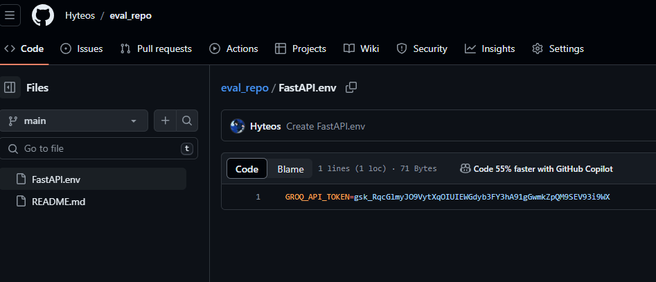
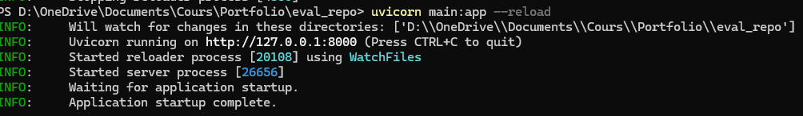
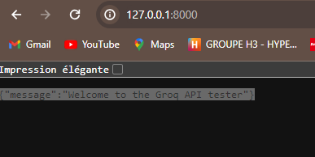
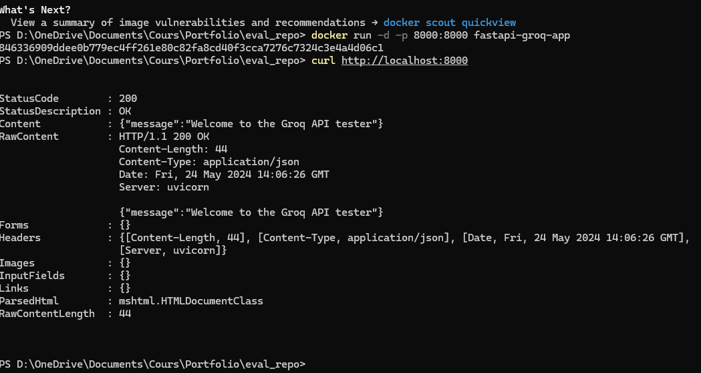
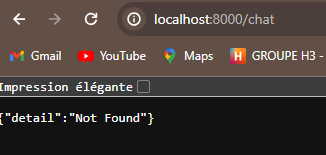
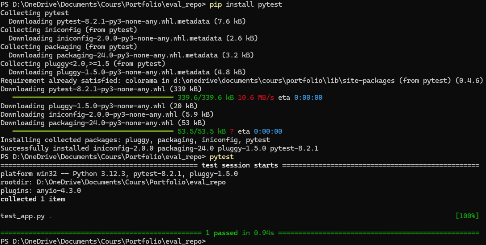

# Voici le repository pour l'évaluation
Partie1:

Création TokenAPI 

Test en local 

Partie 2:

docker build -t fastapi-groq-app .

docker run -d -p 8000:8000 fastapi-groq-app

Test avec /chat

Partie 3:

Création de la branche dev pour test dans mon repository fait.

Création du fichier test_app.py pour vérifier que le point de terminaison racine (/) retourne un statut HTTP 200 et le message attendu.

Test avec pytest

